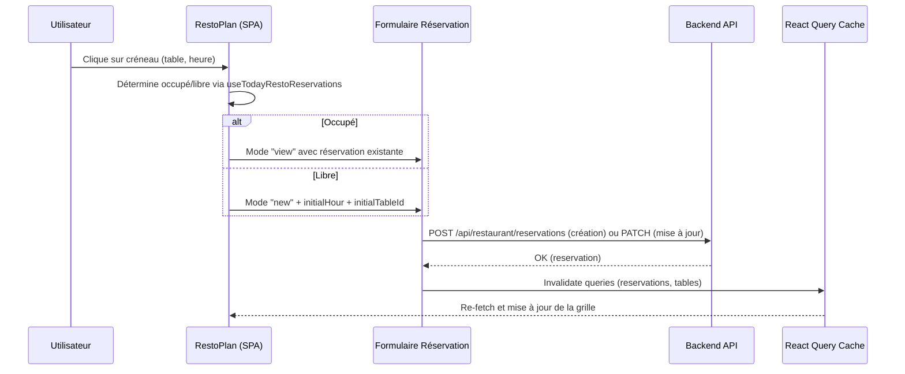
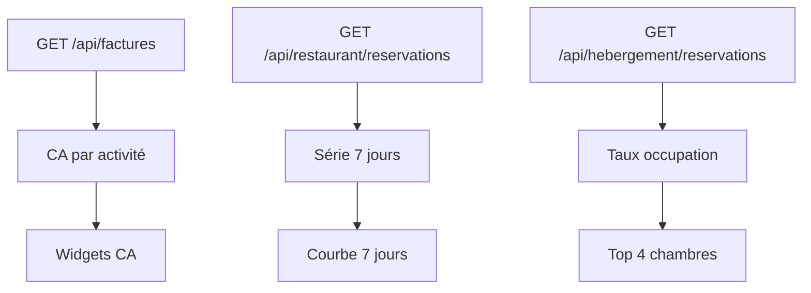

# Handoff Backend — NAS-1 Frontend

Ce document résume l’état du frontend (React) et décrit le contrat d’intégration attendu avec le backend. Il sert de guide pour l’implémentation des API, l’authentification et les conventions communes (types, statuts, erreurs).

## Contexte et périmètre
- SPA en React 18 + TypeScript, routing via React Router 6.
- UI principalement en Material UI (MUI). Tailwind est présent mais peu utilisé.
- State global: Redux Toolkit (`sessionSlice` pour rôle et userName) + hooks `useAppSelector`/`useAppDispatch`.
- Authentification simulée via `AuthContext` (login mock, protection de routes, redirection vers `/login`).
- Données consommées via hooks React Query déclarés dans `client/services/api.ts`, alimentés aujourd’hui par `client/services/mock.ts`.
- Types partagés centralisés dans `shared/api.ts` (interfaces communes pour Facture, Reservation, Client, Evenement, Stock…).
- Serveur Express minimal dans `server/index.ts` (routes `/health`, `/api/ping`, `/api/demo`), utilisé en dev avec Vite (port 8080) et en prod pour servir la SPA.

## Vue d’ensemble fonctionnelle
- Dashboard: KPIs, alertes (stock bas, maintenance), événements à venir, factures en attente.
- Financier (Factures): liste, filtrage, création (statut initial « emise » à normaliser), calcul `totalTTC` à partir des lignes.
- Hébergement: gestion des chambres, calendrier (mois/semaine/jour), filtres de statut (libre, réservée, occupée, maintenance), liste et édition de réservations.
- Restaurant: événements (planifié/confirmé/annulé), filtrage par type (musique, dégustation, anniversaire, conférence, mariage), calendrier mensuel et duplication/édition.
- Admin/RBAC: menu dynamique via `useRBAC`, changement de rôle via `RoleSwitcher` dans `AppLayout`.

## Contrat d’API cible (proposition)
Les routes ci-dessous sont proposées pour remplacer les mocks actuels. Les payloads suivent les types de `shared/api.ts` et les enums normalisés.

### Authentification & Session
- `POST /api/auth/login` → body `{ email, password }`, réponse `{ token, user: { id, name, role } }`.
- `POST /api/auth/logout` → invalide la session.
- `GET /api/auth/me` → retourne l’utilisateur courant et ses rôles/permissions.

JWT conseillé en cookie `HttpOnly` + `SameSite=Lax`.

### Clients
- `GET /api/clients`
- `GET /api/clients/:id`
- `POST /api/clients`
- `PATCH /api/clients/:id`

Exemple (Client):
```json
{
  "id": "cli_123",
  "nom": "Rabe Jean",
  "email": "jean@example.com",
  "telephone": "+261 34 00 00",
  "adresse": "Lot XX",
  "notes": "VIP"
}
```

### Factures
- `GET /api/factures?statut=emise|payee|annulee&clientId=...`
- `GET /api/factures/:numero`
- `POST /api/factures` → crée une facture (numéro généré côté backend)
- `PATCH /api/factures/:numero` → mise à jour (lignes, statut)

Exemple (Facture):
```json
{
  "numero": "FAC-2025-0004",
  "clientId": "cli_123",
  "lignes": [
    { "designation": "Chambre Deluxe", "quantite": 2, "prixUnitaire": 100 }
  ],
  "totalHT": 200,
  "totalTTC": 236,
  "statut": "emise",
  "date": "2025-11-09"
}
```

### Stock
- `GET /api/stock/produits`
- `GET /api/stock/mouvements?type=entree|sortie&date=YYYY-MM`
- `POST /api/stock/mouvements`

Exemple (Produit):
```json
{
  "id": "prd_001",
  "nom": "Vin rouge",
  "categorie": "Boissons",
  "stock": 42,
  "seuilAlerte": 5
}
```

### Hébergement — Réservations
- `GET /api/hebergement/reservations?from=YYYY-MM-DD&to=YYYY-MM-DD&statut=confirme|annule|arrivee`
- `POST /api/hebergement/reservations`
- `PATCH /api/hebergement/reservations/:id`

Exemple (Reservation):
```json
{
  "id": "res_001",
  "type": "hebergement",
  "chambreId": "ch_101",
  "clientId": "cli_123",
  "dateDebut": "2025-11-09",
  "dateFin": "2025-11-12",
  "statut": "confirme"
}
```

### Restaurant — Événements
- `GET /api/restaurant/evenements?mois=YYYY-MM&statut=planifie|confirme|annule&type=...`
- `POST /api/restaurant/evenements`
- `PATCH /api/restaurant/evenements/:id`

Exemple (Evenement):
```json
{
  "id": "ev_100",
  "nom": "Jazz Night",
  "date": "2025-11-14",
  "heures": "19:00–22:00",
  "nb": 80,
  "contact": "contact@example.com",
  "statut": "planifie",
  "type": "musique",
  "notes": "Tenir compte des VIP"
}
```

## Enums & normalisation
À synchroniser strictement entre frontend et backend.

- Facture.statut: `"emise" | "payee" | "annulee"` (remplace l’orthographe actuelle "emisee").
- Reservation.statut: `"confirme" | "annule" | "arrivee"`.
- Chambre.statut (métier côté backend): `"libre" | "reservee" | "occupee" | "maintenance"`.
- Evenement.statut: `"planifie" | "confirme" | "annule"`.
- Evenement.type: `"musique" | "degustation" | "anniversaire" | "conference" | "mariage"`.

Notes:
- Le frontend dérive aujourd’hui l’état des chambres à partir des réservations (et du flag maintenance) — à garder cohérent côté API.
- Pour `occupee`, considérer une logique métier basée sur la plage `dateDebut`–`dateFin` et le statut `arrivee`.

## Auth & RBAC
- Token JWT recommandé en cookie `HttpOnly` (ou Bearer header si nécessaire). 
- `GET /api/auth/me` retourne `{ role, permissions }` selon les rôles vus en front (Admin, Manager, Finance, Hebergement, Restaurant, etc.).
- Le menu est construit dynamiquement en front via `useRBAC`; exposer côté backend une liste de permissions par rôle pour homogénéiser.

## Erreurs & conventions
- Réponse d’erreur standard:
```json
{
  "error": {
    "code": "VALIDATION_ERROR",
    "message": "Champ manquant: clientId",
    "details": { "clientId": "required" }
  }
}
```
- Codes HTTP: 200/201 (OK/Created), 400 (validation), 401 (auth), 403 (RBAC), 404 (not found), 409 (conflit), 500 (server).
- Dates au format ISO `YYYY-MM-DD` (ou ISO8601 avec heure quand nécessaire), fuseau: à définir (idéalement UTC + offset reçu côté client).

## Paramétrage & dev
- Base URL configurable via `VITE_API_URL` côté front.
- CORS: autoriser l’origine du front (dev: `http://localhost:8080`), credentials si cookie.
- Dev proxy optionnel: proxy `/api` vers le backend.

## Phasage d’intégration (proposé)
1. Phase 1 — Lecture: brancher `GET` pour Clients, Factures, Reservations, Evenements.
2. Phase 2 — Écriture: activer `POST/PATCH` (création/édition), gestion des règles métier.
3. Phase 3 — Auth & RBAC: login, session, exposition des droits.
4. Phase 4 — Qualité: validations (`zod` côté front), tests e2e, observabilité.

## Points à régler (identifiés)
- Normaliser `Facture.statut` de `"emisee"` → `"emise"` (frontend et backend).
- Clarifier la dérivation `occupee` dans le calendrier chambres (aligner sur réservations/arrivées). 
- Afficher le nom du client (pas seulement `clientId`) dans la liste des réservations hébergement.

## Références code
- Front: `client/services/api.ts`, `client/services/mock.ts`, pages `client/pages/*`, layout `client/layout/AppLayout.tsx`, auth `client/contexts/AuthContext.tsx`.
- Types: `shared/api.ts`.
- Serveur: `server/index.ts`, `server/node-build.ts`.

---
Document rédigé pour le responsable backend afin de cadrer l’intégration à venir et réduire les allers-retours. Toute divergence de modèle doit être traitée en priorité (enums, formats de date, calculs métiers).

## Changements récents (frontend)
- Restaurant/Plan:
  - Ajout d’une vue journalière interactive des disponibilités (créneaux 10:00–21:00 par table).
  - Clic sur un créneau: si occupé, ouvre la réservation existante en mode « view »; si libre, passe en mode « new » et pré-remplit le formulaire (heure + table).
  - Formulaire « Nouvelle réservation » supporte `initialHour` et `initialTableId` pour le pré-remplissage.
  - Hooks utilisés: `useTodayRestoReservations`, `useCreateRestoReservation`, `useUpdateRestoReservation`, `useDeleteRestoReservation`, `useTables`, `useClients`.
- Financier:
  - Remplacement des blocs statiques par 3 rapports dynamiques:
    - Réservations restaurant sur 7 jours (agrégation par date/heure).
    - Taux d’occupation chambres sur le mois courant (top 4).
    - Chiffre d’affaires agrégé par activité (Hébergement, Restaurant, Événements) basé sur `Facture.lignes`.
  - Suppression du bouton « Relancer impayés » (manquaient règles métier). À ré-introduire côté backend avec statut/relances.
- Hébergement/Clients:
  - Filtre pour n’afficher que les clients ayant des réservations d’hébergement (exclut les clients 100% restaurant).

## Contrat API — Restaurant (Réservations)
- `GET /api/restaurant/reservations?date=YYYY-MM-DD`
  - Retourne la liste des réservations du jour, incluant `tableId`, `heure`, `nbPersonnes`, `statut`.
- `GET /api/restaurant/reservations?from=YYYY-MM-DD&to=YYYY-MM-DD`
  - Pour les rapports (7 jours glissants).
- `POST /api/restaurant/reservations`
  - Crée une réservation: `{ clientId, dateDebut: ISO8601, heure: "HH:mm", nbPersonnes, tableId? }`.
- `PATCH /api/restaurant/reservations/:id`
  - Met à jour: `{ heure?, nbPersonnes?, tableId?, statut? }`.
- `DELETE /api/restaurant/reservations/:id`
  - Annule/supprime une réservation.
- `POST /api/restaurant/tables/assign`
  - Assigne une table: `{ tableId, reservationId }` avec collision check (même table + même heure → 409).

Notes d’alignement:
- `Reservation.type` peut être `"restaurant" | "hebergement"` pour unifier le modèle si souhaité.
- `Reservation.statut`: utiliser `"confirme" | "annule" | "arrivee" | "terminee"` selon le flux métier.
- Les réponses doivent inclure `clientId` et idéalement `client.nom` pour l’affichage immédiat (sinon le front fera une jointure client).

## Contrat API — Financier (Rapports & Factures)
- Rapports (lecture):
  - `GET /api/factures?from=YYYY-MM-DD&to=YYYY-MM-DD` pour l’agrégation par activité.
  - `GET /api/hebergement/reservations?from&to` pour calculer le taux d’occupation.
  - `GET /api/restaurant/reservations?from&to` pour la série 7 jours.
- Facturation:
  - `GET /api/factures?statut=emise|payee|annulee&clientId=...`
  - `GET /api/factures/:numero`
  - `POST /api/factures` → crée une facture (numéro généré backend)
  - `PATCH /api/factures/:numero` → mise à jour (lignes, statut)

Calculs attendus (frontend):
- CA par activité: somme de `quantite * prixUnitaire` par ligne, agrégé par `source` (`hebergement | restaurant | evenements`).
- Taux d’occupation: `jours_occupés / jours_total_du_mois` par chambre, top 4.
- Série 7 jours: count des réservations restaurant par jour, bucket par heure si disponible.

## Diagrammes (Mermaid)

### Flux — Resto Plan (interaction créneau → réservation)


### Architecture — SPA & Serveur
```mermaid
graph LR
  A[React SPA (Vite/MUI/Redux)] -->|HTTP /api| B[Express Dev Server]
  B --> C[Backend API (Node/Java/.NET…)]
  C --> D[(DB)]
  A --> E[React Query Cache]
  E --> A
```

### Données — Financier (agrégations)


## Meilleures pratiques recommandées (sans changements majeurs)
- Validation côté front avec `zod` pour les formulaires (Login, Réservation, Événements) et mapping d’erreurs API.
- Normaliser les enums côté backend et fournir un endpoint des `permissions` par `role` (pour `useRBAC`).
- Unifier les routes: choisir `/restaurant/...` ou `/resto/...` et exposer un alias pour compatibilité.
- Dates/Heures: privilégier ISO8601 (`dateDebut` + `heure`) et explicitement le fuseau (`UTC` + offset). 
- Erreurs UX: remplacer `alert()` par Snackbar/Toast; afficher les collisions de table (`409`) de façon non bloquante.
- React Query: invalider explicitement `tables` et `reservations` après assignation/édition; définir des `staleTime`/`gcTime` adéquats.
- Typage stricte: renforcer `Reservation`, `Facture`, `Evenement` et éviter les `any`; réutiliser les interfaces de `shared/api.ts`.
- Accessibilité: labels, `aria-*` cohérents, focus management sur modales (création facture, événements).
- Observabilité: journaliser (niveau debug) les mutations clés côté backend pour audit (assignation table, création facture).

## Actions backend à prévoir
- Implémenter les endpoints listés et garantir la cohérence des enums.
- Gérer les collisions d’assignation de tables avec code 409 + message explicite.
- Exposer `/auth/me` avec `role` et `permissions` pour alimenter le menu.
- Optimiser les endpoints de rapports (agrégations côté DB si volumétrie élevée).